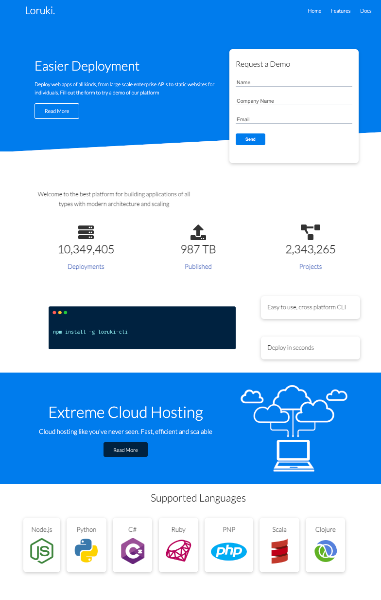

# Loruki website

> The Loruki rebuild project involves redesigning and updating the website of a
> fictional cloud hosting company, with the goal of improving its functionality,
> user experience, and visual appeal.

## Table of contents

- [Loruki website](#loruki-website)
  - [Table of contents](#table-of-contents)
  - [General info](#general-info)
  - [Screenshots](#screenshots)
  - [Technologies](#technologies)
  - [Setup](#setup)
  - [Status](#status)
  - [Group Members](#group-members)

## General info

> The project aims to create a website that reflects the high-quality services
> offered by Loruki and attracts new customers to the company.

## Screenshots

## Technologies

- Html5
- VSC code
- JavaScript
- npm
- ...

## Setup

- clone the rep
- run npm install

## Status

Project is: _done_

## Group Members

| Name                                          |
| --------------------------------------------- |
| [Inna](https://github.com/inna9Z)             |
| [Himanshi](https://github.com/himanshisaxena) |
| [Karol](https://github.com/karol10cano)       |
| [Zahira](https://github.com/ZahiraBella)      |
| [Rahatab](https://github.com/Rahatab)         |
